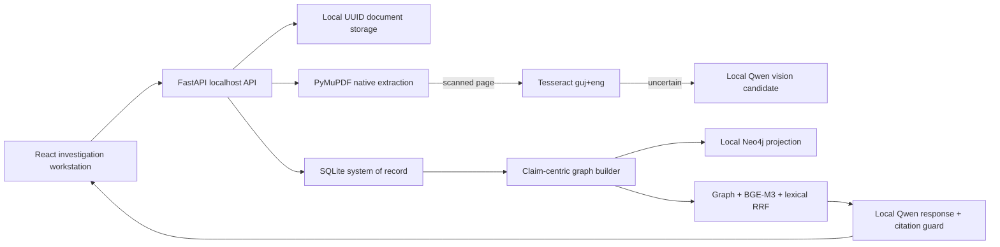

# Gujarat Police Chargesheet Intelligence — Deliverables 1–2

An offline-first investigation workstation for Gujarati/English chargesheet PDFs. It turns a source record into page-level text provenance, candidate entities and claims, an interactive claim-centric case graph, interpretable evidence profiles, a timeline, review queues, and citation-backed GraphRAG answers.

Deliverable 2 adds explicit document roles, multi-document comparison, structured correction and IO-review actions, a Defense Assistant, completeness/format/chain-of-custody checks, and a local imported-judgment review workflow. See [Deliverable 2](docs/DELIVERABLE_2.md).

This is decision support—not an autonomous guilt-determination system. It never produces guilt probabilities or guaranteed case outcomes.

## Privacy guarantee

Runtime case content is restricted to the local machine or explicitly configured private police network addresses. There is no external AI, OCR, embedding, vector, analytics, or storage fallback. The only expected runtime connections are:

- browser → `127.0.0.1:5173` / backend `127.0.0.1:8000`
- backend → Ollama `127.0.0.1:11434`
- backend → Neo4j `127.0.0.1:7687` when enabled

Uploads live under ignored UUID paths in `data/cases/`. Audit logs contain operational metadata, not source text or model I/O.

## Architecture



SQLite is the durable D1 system of record. A local Neo4j Community instance is an optional projection unless `REQUIRE_NEO4J=true`; this keeps the demo usable on a 16 GB fanless Mac while retaining a real Neo4j implementation path.

## M4 Air requirements

- Apple Silicon macOS
- Python 3.11+
- Node 20+
- Homebrew
- Tesseract plus Gujarati language data for scanned documents
- Ollama bound to `127.0.0.1:11434`
- optional local Neo4j Community (Java already required by Neo4j)

Automatic model choice is `qwen3.5:4b` for 16 GB and `qwen3.5:9b` for 24/32 GB. Embeddings use local `bge-m3`. D1 defaults to 2 OCR workers conceptually, serial document processing, LLM concurrency 1, and modest embedding batches of 8.

## Install and run

### macOS (the original Apple Silicon path)

```bash
cd /Users/aditya/Desktop/SAT_del1
make setup
make check
```

If system packages are missing, the setup script prints the exact reviewed Homebrew command. To let it install missing system packages:

```bash
AUTO_INSTALL_SYSTEM=1 make setup
```

Start Ollama locally, download the models once, then start the app:

```bash
OLLAMA_HOST=127.0.0.1:11434 ollama serve
make models
make dev
```

Open [http://127.0.0.1:5173](http://127.0.0.1:5173). The API reference is [http://127.0.0.1:8000/docs](http://127.0.0.1:8000/docs).

### Windows

Windows uses the same local-only architecture, but its setup and launcher scripts are PowerShell equivalents so the macOS scripts remain unchanged. Install Python 3.11+ and Node.js 20+, then run from PowerShell:

```powershell
.\scripts\setup_windows.ps1
.\scripts\check_windows.ps1
.\scripts\run_all.ps1
```

Open `http://127.0.0.1:5173`; the API reference is at `http://127.0.0.1:8000/docs`. To run validation, use `.\scripts\test_windows.ps1`.

Tesseract with `guj` and `eng` language packs is needed for scanned documents. Ollama plus `qwen3.5:4b` and `bge-m3` enables model-backed Q&A and semantic retrieval; without it, the demo and extractive Q&A fallback remain available.

## Demo

1. Open the dashboard.
2. Choose **Load Demo Case**.
3. Inspect Overview, Analysis, Evidence, Timeline, Graph, Documents, and Ask Case.
4. Click any source badge to open its exact PDF page.

The demo is visibly labeled `SYNTHETIC DEMO DATA` and contains only fictional identifiers. It works without Ollama or Neo4j; Q&A falls back to a clearly labeled extractive source view if the local model is unavailable. It never falls back to a network service.

## Uploading a PDF

Use **New Analysis**, enter a case identifier and station, and choose a PDF. The backend checks the PDF signature, size, corruption/password state, filename safety, hash duplicates, and page count. Native text pages bypass OCR. Scanned pages are rendered at 275 DPI and processed with `guj+eng`. Low-confidence results retain Tesseract text and any local vision candidate separately for human review.

## GraphRAG

Questions seed graph nodes, expand relevant graph provenance, run BGE-M3 vector similarity when the local model is ready, run lexical retrieval, and combine ranks using Reciprocal Rank Fusion. A bounded ~8k–12k-token context goes to local Qwen. No entire chargesheet is placed in a prompt. If no source citation exists, the API returns insufficient information rather than a verified factual answer.

## OCR limitations

Tesseract is suitable for printed Gujarati/English, not reliable handwritten Gujarati. Qwen vision output is a candidate only and never silently overwrites OCR. Handwritten/mixed or low-confidence pages stay in the review queue. Bodhan IndicOCR is intentionally not a hard dependency because its primary installation path is CUDA-oriented.

## Tests

```bash
make test
```

This runs backend unit/API/integration tests and frontend lint/build. Test fixtures are synthetic and non-sensitive.

## Troubleshooting

- **Ollama unavailable:** verify `curl http://127.0.0.1:11434/api/tags`; no remote fallback occurs.
- **Gujarati OCR unavailable:** install `tesseract` and `tesseract-lang`, then confirm `tesseract --list-langs` contains `guj` and `eng`.
- **Neo4j unavailable:** leave `NEO4J_ENABLED=false` for the D1 SQLite graph; set `NEO4J_ENABLED=true` with a local URI/password to enable projection. Passwordless mode is suitable only for a temporary localhost test process.
- **Processing stopped:** `/api/cases/{id}/status` exposes a safe configuration error without logging document text.
- **Port conflict:** set `APP_PORT` and update the Vite proxy only to another localhost address.

## D1 limitations and production migration

Deterministic source extraction runs without an LLM and is intentionally conservative. Advanced Gujarati person-name extraction and relation enrichment require a ready local Qwen model and further domain evaluation. Native Neo4j projection is implemented but not required on the laptop. See [Production migration](docs/PRODUCTION_MIGRATION.md) for replacing providers with internal GPU services without changing application logic.
